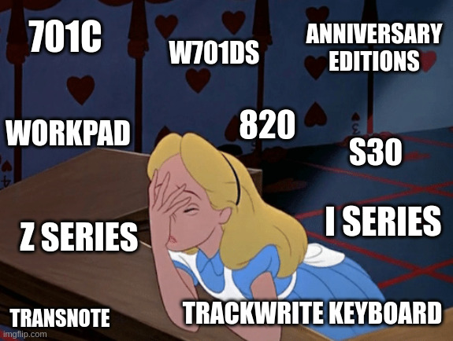

<!-- _class: lead -->

# 🔴 ThinkPads

#### Geschichte und Trivia (die zweite)

 

Christian ~~Sammlowic~~ Stankowic
MRMCD 2024
05.10.2024

---

<!-- _header: `whoami` -->

- Christian Stankowic
- [@stdevel@chaos.social](https://chaos.social/@stdevel) 🐘
- IT-Berater und -Trainer 👨🏻‍🏫
- sammelt obsolete Hardware
- Blogger ([cstan.io](https://cstan.io) 📖)
- Podcaster 🎙️
  - [FOCUS ON: Linux](https://focusonlinux.podigee.io) 🐧
  - [Faxinformatiker](https://faxinformatiker.de) 📠
  - [ThinkPad-Museum](https://thinkpad-museum.de/episode) 💻

---

<!-- _header: ThinkPad-Museum -->

- Online-Museum als **Blog**
- listet Details der Sammlung auf
  - **55** <u>unterschiedliche</u> Notebooks
  - **3** PDAs
  - **8** Docking Stationen
- **WIP**: Bilder-Galerien und ergänzende Artikelserien
- monatlicher **Podcast**
- 🔴 [thinkpad-museum.de](https://thinkpad-museum.de)

---

<!-- _header: ThinkPad-Museum -->

Teil der Sammlung

Transport der Sammlung

---

<!-- _header: Agenda -->

1. Was bisher geschah... ⏪
1. Kurzgeschichte des TrackPoints 🔴
1. Tastaturen ⌨️
1. Weitere Kuriositäten und japanische Exclusives 🇯🇵

---

<!-- _header: '`tar cvfz tldw.tgz https://media.ccc.de/v/froscon2024-3141-thinkpads`' -->

<!-- 
 -->

- ThinkPads werden in Business- und Hacker:innen-Kreisen häufig angetroffen
- **1992** bis **2005** von IBM produziert, seitdem von Lenovo
- stehen für **robuste** und langlebige Geräte
- **zeitloses** Design, praktikabel
- unterschiedliche **Serien** mit vielen Modellen

PDS: Du hast dir [Teil 1](https://media.ccc.de/v/froscon2024-3141-thinkpads) angesehen

<!-- 
 -->

---

<!-- _header: Zeitloses Design, das heute noch erkennbar ist -->

IBM ThinkPad T23 (2001)

Lenovo ThinkPad T470p (2017)

<!--

- Clamshell-Design entfällt bei Lenovo
- blauer Farbton entfällt
- rote Akzente bei TrackPoint und TrackPad bestehen weitehrin
- schräges Logo ist weiterhin eine Marke

-->

---

<!-- _header: Wichtige Personen im ThinkPad-Kosmos -->

- Arimasa Naitoh
  - Father of ThinkPad
  - japanischer Ingenieur
- **Richard Sapper**
  - seit 1979 leitender Designberater bei IBM
- David Hill
  - ThinkPad-Designchef
- **Dr. Ted Selker**
  - Erfinder des **TrackPoints**

- Tom Hardy
  - IBM-Industriedesigner
- **George Karidis**
  - Designer des **TrackWrite Keyboards**
- Mark Pearson
  - pflegt Linux-Support

---

<!--
_header: Richard Sapper (1932 - 2015†)
footer: '[[1]](https://en.wikipedia.org/wiki/Richard_Sapper)'
-->

- einer der wichtigsten Produktdesigner der zweiten Hälfe des 20.Jahrhunderts
- bekannt für zahlreiche innovative Designs, u.a.
  - Artemide Tizio-Tischlampe
  - Alessi-Küchengeräte
  - ...
- ab 1979 **leitender Designberater** bei IBM
- prägte und vereinheitlichte IBM-Designs
  - **schwarze** Farbe bei ThinkPads
  - **roter** TrackPoint

---

<!-- _header: Richard Sapper -->
<!-- footer: '[[2]](https://commons.wikimedia.org/wiki/File:Lampe_Tizio_von_Richard_Sapper.jpg), [[3]](https://richardsapperdesign.com/products/mod-5140/)' -->

Artemide Tizio

IBM PC Convertible Model 5140

<!--

- Lorenz Static (1960)
- IBM PC Convertible Model 5140 (1986)

-->

---

<!-- _header: IBM PC Convertible Model 5140 (1986) -->
<!-- footer: '[[3]](https://richardsapperdesign.com/products/mod-5140/)' -->

---

<!--
footer: '[[4]](https://www.reddit.com/r/thinkpad/comments/h16v1f/tizio_and_thinkpad_the_perfect_classical)' -->

<!--

- Artemide Tizio 50 + ThinkPad T430

-->

---

<!--
_header: '`tar cvfz tldw.tgz https://media.ccc.de/v/froscon2024-3141-thinkpads`'
footer: ''
-->

- es wurde viel experimentiert
  - PDAs (**IBM WorkPad**)
  - PowerPC-Notebooks (**8xx**)
  - kuriose **UltraBay**-Module
  - Notebooks mit zwei Displays
- Jubiläumsmodelle alle 5-10y
- u.a. wegen gutem Linux-Support beliebt
- auch **memetisch** und **popkulturell** relevant

---

<!-- _header: Memetische Relevanz -->
<!-- footer: '[[5]](https://www.reddit.com/r/thinkpad/comments/112wxih/custom_boot_screen_on_my_p1_gen4/)' -->

---

<!-- _header: ThinkPad T61 in Knives Out (2019) -->
<!-- footer: '[[6]](https://productplacementblog.com/movies/lenovo-thinkpad-t61-laptop-used-by-christopher-plummer-as-harlan-thrombey-in-knives-out-2019/)' -->

---

<!-- _header: Ready? -->
<!-- footer: '' -->

---

<!-- _header: Kurzgeschichte des TrackPoints -->
<!-- footer: '[[7]](https://youtu.be/Wpw7Bml_XvI), Patent lief **2007** aus, auch andere Hersteller hatten vorher bereits Alternativen' -->

- in den späten **1980ern** von **Dr. Ted Selker** als Mausersatz erfunden*
- Gummifläche zwischen den **G**-, **H**- und **B**-Tasten
- **präzise** Bedienung, erinnert an **Joystick**
  - Finger kann auf der Tastatur verweilen
  - kein "Touchpad-Rudern"
  - erfordert Training
- ging mit dem ThinkPad 700 in Serie
  - inspirierte auch andere Hersteller

---

<!-- _header: Kurzgeschichte des TrackPoints -->
<!-- footer: '[[8]](https://de.wikipedia.org/wiki/Datei:Pointing_stick_of_a_Lenovo_ThinkPad_keyboard-4488.jpg), Patent lief **2007** aus, auch andere Hersteller hatten vorher bereits Alternativen' -->

- Funktion beruht auf **Messung** der ausgeübten Kraft über **Dehnungsstreifen**
- diese werden **elastisch** verformt, dauerhaft angelegte **Spannung** verändert sich so
- integrierter Schaltkreis wandelt diese analogen Signale um
- inzwischen auch in anderen Tastaturen zu finden

---

<!-- _header: Trivia: Unterschiedliche TrackPoint-Typen -->
<!-- footer: '[[9]](https://www.reddit.com/r/thinkpad/comments/h16v1f/tizio_and_thinkpad_the_perfect_classical)' -->

<!--

- wurden die Jahre über immer optimiert
- wurden kleiner, da die Geräte auch kleiner werden
- billiger Replicas erkennt man daran, dass sie schnell **speckig** werden

-->

---

<!-- _header: Tastaturen -->
<!-- footer: '' -->

- waren lange **USP** für ThinkPads
  - angenehmes taktiles Feedback
  - unverwüstliche Qualität
  - einfach zu wechseln
- IBM baute lange hochwertige Tastaturen
  - u.a. [Model F](https://www.clickclackhack.de/029.html) 🎙️ und [Model M](https://www.clickclackhack.de/015.html) 🎙️
- zahlreiche Veränderungen im Laufe der Jahre
  - inzwischen nichts Besonderes mehr

---

<!-- _header: Tastaturen -->
<!-- footer: '[[10]](https://deskthority.net/wiki/Scissor_switch)' -->

- alle Generationen haben **Scissor Switches**
  - früher NMB, Chicony, ALPS, inzwischen nur noch Chicony und LiteOn
- gegenüberliegende Stabilisatoren, über ein Scharnier verbunden
- ermöglicht Scherenmechanismus mit geringer Höhe
- der **Tastenhub** sank über die Jahre
  - 3mm (199x), 2.5mm (2000-2012), 2.1mm (2013-2017), **1.8mm** (2016-2021), 1.5mm (2021-2024), 1,35mm (seit 2021)

---

<!-- _header: TrackWrite-Keyboard (1995 - 1996) -->
<!-- footer: 'Patent- und Markenamt so: Lol, nein 🙅🏻‍♂️' -->

- Tastatur des **701**, welches ursprünglich **Butterfly** heißen sollte*
- ca. **24.7 cm** breite Tastatur, schiebt sich auf **29,3 cm** aus
  - in etwa so breit wie die Tastatur eines T60, beachtliche komfortabel
  - Tastatur klappt sich **diagonal** aus
- Produktion des Geräts **verzögerte** sich mehrfach
  - u.a. aufgrund der Tastatur
  - als es 1995 erschien war der 80486 hoffnungslos veraltet
- Gerät gewann zahlreiche Preise
  - kommerziell aber kein Erfolg
- ikonischstes ThinkPad aller Zeiten

---

<!-- _header: TrackWrite-Keyboard (1995 - 1996) -->
<!-- footer: '[[11]](https://en.wikipedia.org/wiki/File:IBM_ThinkPad_701C_keyboard.jpg), [[12]](https://youtu.be/rDjg4dKWQ2Y)' -->

---

<!-- _header: OG-Tastatur (hier: 760EL, 1996) -->
<!-- footer: '' -->

- 7-reihiges Design, bei kleinen Geräten nur 6 Reihen (z.B. 240)
- keine Sondertasten oder LEDs, vom 700 (1992) bis zum 600X (2000)

<!--

- Blaue und grüne Markeriungen für Mehrfachbelegungen

-->

---

<!-- _header: 'Klassische Tastatur (hier: T23, 2002)' -->

- mit dem A/T/X20 eingeführt, brauchte u.a. **mittlere Maustaste**
- **Sondertasten** (Lautstärke, Setup), Status-**LEDs** und An/Aus-Knopf

---

<!-- _header: 'Klassische Tastatur (hier: T30, 2003)' -->

- ab dem T/R/X30 leicht verändertes Design
  - blaue und graue Farben, kleinere Maustasten (**UltraNav**-Vorbereitung)

---

<!-- _header: 'Klassische Tastatur (hier: R40, 2003)' -->

- keine Status-LEDs mehr ab dem T/R/X/G40 , **Access IBM**-Taste

<!--

- BIOS-Aufruf über Access IBM-Taste
- Pre-Boot-Environment mit Restore-Funktion
  - erfordert Service-Partition auf der Festplatte

-->

---

<!-- _header: 'Klassische Tastatur (hier: T60p, 2007)' -->

- kein grauer Kontrast mehr ab T/R/X60
- TrackPoint-Tasten haben keine Farben mehr

---

<!-- _header: 'Klassische Tastatur (hier: T410, 2010)' -->

- ab dem T410/X220 **beleuchtete** Funktionstasten, **Wippschalter** für Lautstärke sowie **doppelte Höhe** der ESC/ENTF-Taste

---

<!-- _header: Precision-Keyboard -->
<!-- footer: '[[13]](https://nuts.com/images/auto/801x534/assets/869ed4decfec61cb.jpg)' -->

- **2012** in **T**-, **W**-, **X**- und **L**-Serien eingeführt
  - erstmalig im **X1** verbaut
  - weitere Tests in der Edge- und X1xxe-Serie
- **Chiclet**- bzw. Island Style-Tastatur
  - flache quadratische Tasten mit abgerundeten Ecken
  - erinnern an amerikanische Chiclet-**Kaugummis**
- **6** statt 7 Reihen, auch bei großen Geräten
  - mehr **Freiräume** zwischen den Tasten
  - **größere** Tasten, soll Tippfehlern vorbeugen
  - keine separate Funktionstasten mehr

---

<!-- _header: Precision-Keyboard (X230, 2012) -->
<!-- footer: '' -->

---

<!-- _header: Precision-Keyboard -->

- Seite vorwärts/weiter weicht Bild runter/hoch
- keine Num- und Kontextmenü-Tasten mehr
- keine blauen Farbelemente mehr
- Tasten nur noch **2mm** statt 2,5mm **hoch**
- **Mechanismus** jedoch unverändert
- **Backlight**, dadurch Entfall des **ThinkLights**
- Tastaturbeschichtung variiert je nach Variante
  - ohne Backlight: matt, rutschfest, undurchsichtig
  - mit Backlight: glatter, leicht rutschiger Finish

---

<!-- _header: Revival des Classic Keyboards (T25, 2017) -->

---

<!-- _header: IBM Palm Top PC110 (1995) -->
<!-- footer: '[[14]](https://en.wikipedia.org/wiki/IBM_Palm_Top_PC_110), Intel 80486 @ 33 MHz, 4 bis 20 MB RAM' -->

- Palmtop mit **4,7" DSTN**-Display
  - 640x480 und 256 Farben
- 4 MB Flash + PCMCIA/CF
- schmaler aber dicker als eine VHS-Kassette, **630g** schwer
- Mini-Tastatur und -Touchpad
  - **TrackPoint** oben links
- Mikrofon und Lautsprecher
  - durch Modem auch als **Telefon** nutzbar

---

<!-- _header: IBM Palm Top PC110 (1995) -->
<!-- footer: '[[14]](https://en.wikipedia.org/wiki/IBM_Palm_Top_PC_110), [[15]](https://www.youtube.com/watch?v=D-v6kyEDCNo)' -->

Docking-Station

PC110 als Telefon

<!-- 

- Nokia hat mit dem N-Gage also eindeutig bei IBM abgeschaut..

-->

---

<!-- _header: ThinkPad TV-Tuner (1994/1995)  -->
<!-- footer: '[[16]](https://forum.thinkpads.com/viewtopic.php?t=134090), Sender-/Eingangauswahl, Konfiguration, an/aus' -->

- für **355**, **360**, **370** und **750**
- ersetzte das Floppy
- externe Antenne und zusätzlicher **Composite-Port**
- Knöpfe zur Steuerung*
- Modul wurde nach dem Notebook eingeschaltet, übernahm **TFT**-Kontrolle
  - Betriebssystem lief im Hintergrund weiter

<!--

- inkompatibel mit STN-Bildschirmen

-->

---

<!-- _header: ThinkPad TV-Tuner (1994/1995)  -->
<!-- footer: '[[16]](https://forum.thinkpads.com/viewtopic.php?t=134090), [[17]](https://www.youtube.com/watch?v=Kp2RMttq7l0)' -->

Externe Antenne

TV-Bild mit integrierter Kanal-Anzeige

---

<!-- _header: ThinkPad 360P/PE Tablet (1994 - 1996)  -->
<!-- footer: '[[18]](https://commons.wikimedia.org/wiki/Category:ThinkPad_360PE)' -->

- 9.5"-**Convertible Tablet**
  - Bildschirm **im Rahmen** drehbar
- Intel 80486 mit 33 oder 50 MHz
- 4 bis 20 MB RAM
- 170 bis 540 MB HDD
- **DIN A4**-Format, **~3.1kg** Gewicht
- kam mit Windows 3.1 oder 95
  - 3.1 hatte bereits optionalen Stiftsupport (**Windows for Pencomputer 1.0**)

---

<!-- _header: ThinkPad 360P/PE Tablet (1994 - 1996)  -->

Bildschirm im Rahmen gedreht

Tablet-Modus

---

<!-- _header: Exkurs: Windows for Pencomputer 1.0 (1992) -->
<!-- footer: '[[19]](https://winhistory.de/more/win31.htm#pen)' -->

On-Screen Tastatur

Eingabe in Systemdialogen

---

<!-- _header: IBM TransNote (2001 - 2003)  -->
<!--
footer: '[[20]](https://thinkwiki.de/Transnote), Intel Pentium 3 Mobile, 600 MHz, 64-320 MB SDRAM, 10.4"-Touchscreen, 10-20 GB HDD'
-->

- ThinkPad mit digitaler Schreibunterlage (**ThinkScribe**)
- überträgt Handschrift und Zeichnungen als **Bitmap**
- auch bei ausgeschaltetem Notebook nutzbar
- erfordert speziellen **Stift**
  - überträgt Position über **Funk**
  - schreibt auch mit Tinte
- basiert teilweise auf dem **X21***

---

<!-- _header: IBM TransNote (2001 - 2003)  -->
<!--
footer: '[[21]](https://pc.watch.impress.co.jp/docs/article/990204/crosspad.htm)
, zwischen 1998 und 2001 produziert'
-->

- es gab sogar ein **Linkshänder**-Umbaukit
- basiert auf dem **CrossPad***
  - Kollaboration zwischen IBM und **A.T. Cross**
  - externe Schreibunterlage
- sehr aufwändiges Design
  - insbesondere der Stift erforderte viel Gehäuseanpassungen
- Preis: ~3.000 USD (**4.780 EUR**)

CrossPad XP und CrossPad

<!--

- A.T. Cross ist ein US-Hersteller für Schreibgeräte und Uhren
  - produzieren seit den 1970ern die Füller der US-Präsidenten
- CrossPad kostete 1998 399 USD
  - umgerechnet + inflationsbereinigt 690 EUR
  - später für 99 USD verkauft
- Gerät war seiner Zeit voraus und floppte daher
- Kritik war u.a., dass es zu groß war
  - IBM kaufte Flugzeugsitzreihen und bewies, wie komfortabel es sich benutzen lässt
- wurde im Laufe der Zeit immer günstiger und am Ende für **749 USD** verkauft

-->

---

<!-- _header: IBM TransNote (2001 - 2003)  -->
<!--
footer: '[[22]](https://www.reddit.com/r/thinkpad/comments/1q0g9z/any_love_for_a_factory_lefthanded_thinkpad/), [[23]](http://www.ibmfiles.com/pages/transnote.htm)'
-->

Linkshändige Version

Verschiedene Display-Positionen

---

<!-- _header: ThinkPad Tablet (2011 - 2012)  -->
<!--
footer: '[[24]](https://thinkwiki.de/ThinkPad_Tablet), NVIDIA Tegra 2, 1 GB RAM, 10.1"-TFT (1280x800)'
-->

- einziges **Android**-Tablet*
- Android 3.1 und 4.0.3
  - kaum alternative ROMs
- Kopfhörer und **Eingabestift**
- optionale Docking und Hülle mit eingebauter Tastatur
- vorinstallierte Business-Anwendungen
- schwer (753g) und teuer (~899 EUR)

---

<!-- _header: Japanische Exclusives  -->
<!--
footer: '[[25]](https://thinkwiki.de/550)'
-->

- es gab schon früh Sondermodelle für den asiatischen Raum
- kl. Geräte und **Kollaborationen**
  - Canon (**550BJ, 555BJ**)
  - Ricoh (**235**)
- existieren auch heute noch
  - u.a. Tastatur mit mehr Tasten
  - T14p, R14, S2, ThinkPad neo

550BJ mit integriertem Drucker

---

<!-- _header: ThinkPad 220 (1993) -->
<!-- footer: '[[26]](https://commons.wikimedia.org/wiki/Category:ThinkPad_220), 226x166x32mm bei 1 kg Gewicht' -->

- frühes Ultra Portable*
- Intel 386SL mit 16 MHz
- 2 bis 10 MB RAM
- 7.7" STN Graustufen-Display
  - 640x480, Farbe via VGA
  - **ohne Hintergrundbeleuchtung**
- 80 MB HDD
- konnte auch mit 6x AA-Batterien betrieben werden

---

<!-- _header: ThinkPad 220 (1993) -->
<!-- footer: '[[26]](https://commons.wikimedia.org/wiki/Category:ThinkPad_220)' -->

---

<!-- _header: ThinkPad 235 / Ricoh Magio* (1998)  -->
<!--
footer: '[[27]](https://www.youtube.com/watch?v=RDyMw7t9bdw), auch: Hitachi VisionBook Traveler, Epson Endeavor TK-300/400, Hitachi Flora Prius Note 210'
-->

---

<!-- _header: ThinkPad 235 / Ricoh Magio* (1998) -->
<!--
footer: '[[28]](https://thinkwiki.de/235), auch: Hitachi VisionBook Traveler, Epson Endeavor TK-300/400, Hitachi Flora Prius Note 210'
-->

- **9.2"-Subnotebook** (800x600)
  - Intel Pentium 166 bis 266 MHz
  - 32 bis 96 MB RAM
  - **3x** PCMCIA/CardBus
  - 2x Standard **Camcorder-Akkus**
- außerhalb Japans nur als Fremdmarke erhältlich
- von **RIOS** gefertigt
  - Joint-Venture von Ricoh und IBM Japan

Tastatur des 235

<!--

- mit 2.399 USD (4.150 EUR) recht teuer
  - recht schnell auf 1.800 USD gefallen

-->

---

<!-- _header: ThinkPad 235 / Ricoh Magio* (1998) -->
<!--
footer: '[[27]](https://www.youtube.com/watch?v=RDyMw7t9bdw), auch: Hitachi VisionBook Traveler, Epson Endeavor TK-300/400, Hitachi Flora Prius Note 210'
-->

Standard Li-Ion-Akkus

Das 235 hat sogar USB 1.1, Fremdmarken nicht

<!--

- BIOS ist jederzeit per Tastenkombination aufrufbar 
- Das TP235 hat das größere und bessere Display
  - und sogar USB 1.1

-->

---

<!-- _header: ThinkPad S30 / S31 (2001) -->
<!-- footer: '[[28]](https://thinkwiki.de/S30_/_S31), Intel Pentium 3 @ 600 MHz, 128-256 MB RAM, 20 GB HDD' -->

- einzige Vertreter der S-Serie
- **letzte** 10.4"-Subnotebooks
  - X-Serie wurde immer kompakter
  - eng mit dem **X20** verwandt
- S30 für Japan, S31 für restlichen asiatischen Raum
- S31 ist auch das Sondermodell zum 10-jährigen **Jubiläum**
- i.d.R. glänzender Deckel
  - später in **SL**-Serie aufgegriffen

<!--

- S30 und X60s sind fast gleich groß

-->

---

<!-- _header: ThinkPad S30 / S31 (2001) -->
<!-- footer: '[[28]](https://thinkwiki.de/S30_/_S31)' -->

Bauchiges Gehäuses passt sich der Tastatur an

Matter Displaydeckel, Fuß im Akku jedoch immer glänzend

---

<!-- footer: [[29]](https://www.thinkpad.com/device/ThinkPad-T14p-2023) -->

<!--

- 14"-Gerät mit Intel Core i9 und NVIDIA GTX-GPU
  - starke Konfiguration ungewöhnlich, i.d.R. P-Serie vorbehalten
- Performance-Varianten waren seit dem T470p (2017) bis zum T15p (2021) nicht verfügbar
  - gibt aktuell auch nur das T15p, keine anderen Varianten
- silbernen Displayscharniere sind ein Relikt früherer Geräte
  - gibt es außerhalb Asiens seit dem T430 (2014) nicht mehr
  - nur das P16 hat es noch

-->

---

<!-- _header: Links -->
<!-- footer: '' -->

- [FrOSCon 2024: ThinkPads - Geschichte und Nerdkultur](https://media.ccc.de/v/froscon2024-3141-thinkpads) 🎥
- [ThinkPad-Forum](https://thinkpad-forum.de)
- [ThinkPad-Wiki](https://thinkwiki.de)
- [Internationales ThinkWiki](https://thinkwiki.org)
- [Notebookcheck-Beiträge zu ThinkPads](https://www.notebookcheck.com/News.37.0.html?ns_layout=3&hide_youtube=1&ns_show_num_normal=50&hide_external_reviews=1&tagArray%5B%5D=153&typeArray%5B%5D=4&typeArray%5B%5D=6&id=37)
- [Laptop Retrospective](https://laptopretrospective.com) 🎥📖
- [HK003 - ThinkPads](https://hacker-kultur.de/episodes/003.html) 🎙️
- [BW099 - Ein denkwürdiges Notebook](https://besserwissen.podigee.io/99-thinkpad) 🎙️
- [ThinkPad-Museum](https://thinkpad-museum.de)
- [ThinkPad-Museum Datenbank](https://db.thinkpad-museum.de)

---

<!-- _header: Fachlektüre -->

Zu diesen Themen gibt es passende **Bücher**:

- How the ThinkPad Changed the World - and Is Shaping the Future
  - Arimasa Naitoh, William J. Holstein
- The Race for Perfect
  - Steve Hamm, Story über das X300
- ThinkPad: A Different Shade of Blue
  - Deborah A. Dell, J. Gerry Purdy
- **Richard Sapper, Edited by Jonathan Olivares**
  - Hardcover-Buch mit vielen Fotos

---

<!-- _header: ThinkPad-Museum Podcast -->

- erscheint alle **~4 Wochen**
- beschäftigt sich mit der Geschichte und Gegenwart
- News, Modelle, Techniken und Persönlichkeiten
- **interaktives** Format, Gäst:innen willkommen!
- Überall, wo es Podcasts gibt™
  - [Feed](https://podcasts.darmstadt.social/@thinkpadmuseum/feed.xml), [fyyd](https://fyyd.de/podcast/thinkpad-museum-podcast), [Apple Podcasts](https://podcasts.apple.com/us/podcast/thinkpad-museum-podcast/id1722845536), [Spotify](https://open.spotify.com/show/1Tyf65RpY3bKZr0xYVFhjc)

---

<!-- _header: Bilderquellen -->

- [Richard Sapper](https://en.wikipedia.org/wiki/Richard_Sapper)
- [Artemide Tizio](https://commons.wikimedia.org/wiki/File:Lampe_Tizio_von_Richard_Sapper.jpg)
- [IBM Model 5140](https://richardsapperdesign.com/products/mod-5140/)
- [Tizio und T430](https://www.reddit.com/r/thinkpad/comments/h16v1f/tizio_and_thinkpad_the_perfect_classical)
- [Lenowo BIOS-Logo](https://www.reddit.com/r/thinkpad/comments/112wxih/custom_boot_screen_on_my_p1_gen4/)
- [Knives Out](https://productplacementblog.com/movies/lenovo-thinkpad-t61-laptop-used-by-christopher-plummer-as-harlan-thrombey-in-knives-out-2019/)
- [Ted Selker](https://youtu.be/Wpw7Bml_XvI)
- [TrackPoint PCB](https://de.wikipedia.org/wiki/Datei:Pointing_stick_of_a_Lenovo_ThinkPad_keyboard-4488.jpg)
- [TrackPoint-Typen](https://www.reddit.com/r/thinkpad/comments/h16v1f/tizio_and_thinkpad_the_perfect_classical)
- [Scissor Switch](https://deskthority.net/wiki/Scissor_switch)
- [TrackWrite Keyboard](https://en.wikipedia.org/wiki/File:IBM_ThinkPad_701C_keyboard.jpg)
- [George Karidis](https://youtu.be/rDjg4dKWQ2Y)
- [Chiclet Gum](https://nuts.com/images/auto/801x534/assets/869ed4decfec61cb.jpg)
- [IBM PC110](https://en.wikipedia.org/wiki/IBM_Palm_Top_PC_110)
- [IBM PC110 Phone](https://www.youtube.com/watch?v=D-v6kyEDCNo)
- [ThinkPad 750 TV Tuner Pack](https://forum.thinkpads.com/viewtopic.php?t=134090)

- [ThinkPad 750 TV Tuner Demo](https://www.youtube.com/watch?v=Kp2RMttq7l0)
- [360PE](https://commons.wikimedia.org/wiki/Category:ThinkPad_360PE)
- [Windows for Pencomputer 1.0](https://winhistory.de/more/win31.htm#pen)
- [IBM TransNote](https://thinkwiki.de/Transnote)
- [CrossPad XP](https://pc.watch.impress.co.jp/docs/article/990204/crosspad.htm)
- [TransNote Left-handed](https://www.reddit.com/r/thinkpad/comments/1q0g9z/any_love_for_a_factory_lefthanded_thinkpad/)
- [TransNote Stages](http://www.ibmfiles.com/pages/transnote.htm)
- [ThinkPad Tablet](https://thinkwiki.de/ThinkPad_Tablet)
- [550BJ](https://thinkwiki.de/550)
- [220](https://commons.wikimedia.org/wiki/Category:ThinkPad_220)
- [235 vs. Ricoh Magio](https://www.youtube.com/watch?v=RDyMw7t9bdw)
- [235](https://thinkwiki.de/235)
- [S30 / S31](https://thinkwiki.de/S30_/_S31)
- [T14p](https://www.thinkpad.com/device/ThinkPad-T14p-2023)

---

<!-- _class: lead -->

# 🔴 Danke für die Aufmerksamkeit
