

<!-- _class: lead -->

# 🔴 ThinkPads

#### History and trivia (Part Two)

 

Christian ~~Sammlowic~~ Stankowic
MRMCD 2024
05.10.2024

---

<!-- _header: `whoami` -->

- Christian Stankowic
- [@stdevel@chaos.social](https://chaos.social/@stdevel) 🐘
- IT consultant and trainer 👨🏻‍🏫
- collects obsolete hardware
- Blogger ([cstan.io](https://cstan.io) 📖)
- Podcaster 🎙️
  - [FOCUS ON: Linux](https://focusonlinux.podigee.io) 🐧
  - [Faxinformatiker](https://faxinformatiker.de) 📠
  - [ThinkPad-Museum](https://thinkpad-museum.de/episode) 💻

---

<!-- _header: ThinkPad museum -->

- Online museum as **blog**
- lists collection details
  - **55** <u>different</u> notebooks
  - **3** PDAs
  - **8** Docking stations
- **WIP**: photo galleries and additional post series
- monthly **podcast** (🇩🇪)
- 🔴 [thinkpad-museum.com](https://thinkpad-museum.com)

---

<!-- _header: ThinkPad museum -->

Part of the collection

Transporting the collection

---

<!-- _header: Agenda -->

1. What happened so far... ⏪
1. Short TrackPoint history 🔴
1. Keyboards ⌨️
1. More curiosities and Japanese exclusives 🇯🇵

---

<!-- _header: '`tar cvfz tldw.tgz https://media.ccc.de/v/froscon2024-3141-thinkpads`' -->

<!-- 
 -->

- ThinkPads are frequently encountered in business and hacker circles
- **1992** to **2005** produced by IBM, since then by Lenovo
- stand for **robust** and durable devices
- **timeless** design, practical
- different **series** with many models

POV: You've watched [part one (🇩🇪)](https://media.ccc.de/v/froscon2024-3141-thinkpads)

<!-- 
 -->

---

<!-- _header: Timeless design that is still recognizable today -->

IBM ThinkPad T23 (2001)

Lenovo ThinkPad T470p (2017)

<!--

- Clamshell design no longer available from Lenovo
- Blue color is omitted
- red accents on TrackPoint and TrackPad remain
- slanted logo is still a brand

-->

---

<!-- _header: Important people in the ThinkPad cosmos -->

- Arimasa Naitoh
  - Father of ThinkPad
  - Japanese Engineer
- **Richard Sapper**
  - since 1979 senior design consultant at IBM
- David Hill
  - ThinkPad-Designchef
- **Dr. Ted Selker**
  - **TrackPoins** inventor

- Tom Hardy
  - IBM industrial designer
- **George Karidis**
  - **TrackWrite Keyboard** designer
- Mark Pearson
  - maintaines Linux support

---

<!--
_header: Richard Sapper (1932 - 2015†)
footer: '[[1]](https://en.wikipedia.org/wiki/Richard_Sapper)'
-->

- one of the most important product designers of the second half of the 20th century
- known for numerous innovative designs, e.g.
  - Artemide Tizio table lamp
  - Alessi kitchen appliances
  - ...
- from 1979 **leading design consultant** at IBM
- shaped and standardized IBM designs
  - **black** color for ThinkPads
  - **red** TrackPoint

---

<!-- _header: Richard Sapper -->
<!-- footer: '[[2]](https://commons.wikimedia.org/wiki/File:Lampe_Tizio_von_Richard_Sapper.jpg), [[3]](https://richardsapperdesign.com/products/mod-5140/)' -->

Artemide Tizio

IBM PC Convertible Model 5140

<!--

- Lorenz Static (1960)
- IBM PC Convertible Model 5140 (1986)

-->

---

<!-- _header: IBM PC Convertible Model 5140 (1986) -->
<!-- footer: '[[3]](https://richardsapperdesign.com/products/mod-5140/)' -->

---

<!--
footer: '[[4]](https://www.reddit.com/r/thinkpad/comments/h16v1f/tizio_and_thinkpad_the_perfect_classical)' -->

<!--

- Artemide Tizio 50 + ThinkPad T430

-->

---

<!--
_header: '`tar cvfz tldw.tgz https://media.ccc.de/v/froscon2024-3141-thinkpads`'
footer: ''
-->

- there were a lot of experiments
  - PDAs (**IBM WorkPad**)
  - PowerPC notebooks (**8xx**)
  - curious **UltraBay** modules
  - Notebooks with two displays
- Anniversary models every 5-10y
- popular due to good Linux support, among other things
- also **memetically** and **popculturally** relevant

---

<!-- _header: Memetic relevance -->
<!-- footer: '[[5]](https://www.reddit.com/r/thinkpad/comments/112wxih/custom_boot_screen_on_my_p1_gen4/)' -->

---

<!-- _header: ThinkPad T61 in Knives Out (2019) -->
<!-- footer: '[[6]](https://productplacementblog.com/movies/lenovo-thinkpad-t61-laptop-used-by-christopher-plummer-as-harlan-thrombey-in-knives-out-2019/)' -->

---

<!-- _header: Ready? -->
<!-- footer: '' -->

---

<!-- _header: Short TrackPoint history -->
<!-- footer: '[[7]](https://youtu.be/Wpw7Bml_XvI), Patent expired **2007**, other manufacturers also had alternatives before then' -->

- invented in the late **1980s** by **Dr. Ted Selker** as a mouse replacement*
- Rubber surface between the **G**, **H** and **B** buttons
- **precise** operation, reminiscent of **joystick**
  - Finger can remain on the keyboard
  - no “touchpad rowing"
  - requires training
- went into production with the ThinkPad 700
  - also inspired other manufacturers

---

<!-- _header: Short TrackPoint history -->
<!-- footer: '[[8]](https://de.wikipedia.org/wiki/Datei:Pointing_stick_of_a_Lenovo_ThinkPad_keyboard-4488.jpg), Patent expired **2007**, other manufacturers also had alternatives before then' -->

- Function is based on **measurement** of the force exerted via **stretch marks**
- these are **elastically** deformed, permanently applied **tension** thus changes
- integrated circuit converts these analog signals
- can now also be found in other keyboards

---

<!-- _header: Trivia: Different TrackPoint types -->
<!-- footer: '[[9]](https://www.reddit.com/r/thinkpad/comments/h16v1f/tizio_and_thinkpad_the_perfect_classical)' -->

<!--

- wurden die Jahre über immer optimiert
- wurden kleiner, da die Geräte auch kleiner werden
- billiger Replicas erkennt man daran, dass sie schnell **speckig** werden

-->

---

<!-- _header: Keyboards -->
<!-- footer: '' -->

- were **USP** for ThinkPads for a long time
  - pleasant tactile feedback
  - indestructible quality
  - easy to change
- IBM built high-quality keyboards for a long time
  - e.g. [Model F](https://www.clickclackhack.de/029.html) 🎙️ and [Model M](https://www.clickclackhack.de/015.html) 🎙️
- numerous changes over the years
  - no longer anything special

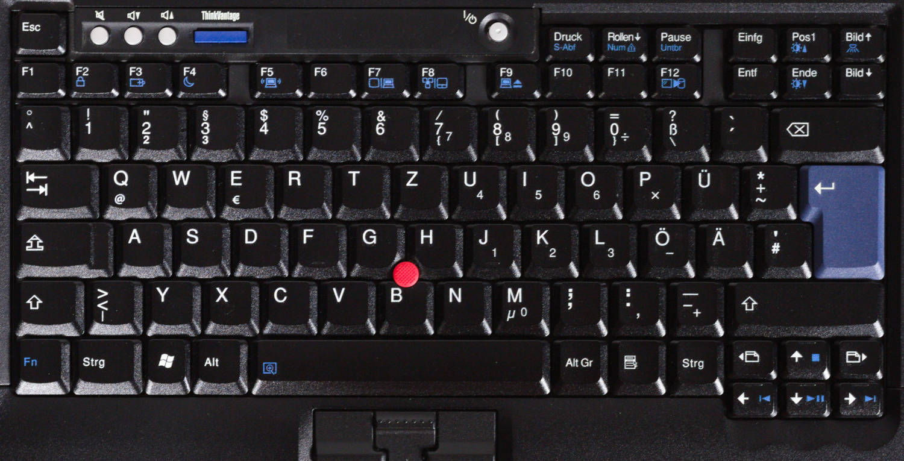

---

<!-- _header: Keyboards -->
<!-- footer: '[[10]](https://deskthority.net/wiki/Scissor_switch)' -->

- all generations have **scissor switches**
  - formerly NMB, Chicony, ALPS, now only Chicony and LiteOn
- Opposite stabilizers, connected via a hinge
- enables scissor mechanism with low height
- the **key travel** decreased over the years
  - 3mm (199x), 2.5mm (2000-2012), 2.1mm (2013-2017), **1.8mm** (2016-2021), 1.5mm (2021-2024), 1.35mm (since 2021)

---

<!-- _header: TrackWrite keyboard (1995 - 1996) -->
<!-- footer: 'Patent and trademark office like: Lol, nope 🙅🏻‍♂️' -->

- Keyboard of the **701**, which was originally to be called **Butterfly**
- approx. **24.7 cm** wide keyboard, extends to **29.3 cm**
  - about as wide as the keyboard of a T60, remarkably comfortable
  - Keyboard folds out **diagonally**
- Production of the device **delayed** several times
  - partly due to the keyboard
  - when it was released in 1995, the 80486 was hopelessly outdated
- device won numerous awards
  - but wasn't a commercial success
- most iconic ThinkPad of all time

---

<!-- _header: TrackWrite keyboard (1995 - 1996) -->
<!-- footer: '[[11]](https://en.wikipedia.org/wiki/File:IBM_ThinkPad_701C_keyboard.jpg), [[12]](https://youtu.be/rDjg4dKWQ2Y)' -->

---

<!-- _header: OG keyboard (here: 760EL, 1996) -->
<!-- footer: '' -->

- 7-row design, only 6 rows on small devices (e.g. 240)
- no special keys or LEDs, from the 700 (1992) to the 600X (2000)

<!--

- Blue and green markers for multiple assignments

-->

---

<!-- _header: 'Classic keyboard (here: T23, 2002)' -->

- introduced with the A/T/X20, needed, among other things, **middle mouse button**
- **special buttons** (volume, setup), status **LEDs** and on/off button

---

<!-- _header: 'Classic keyboard (here: T30, 2003)' -->

- Slightly different design from the T/R/X30 onwards
  - blue and grey colors, smaller mouse buttons (**UltraNav** preparation)

---

<!-- _header: 'Classic keyboard (here: R40, 2003)' -->

- No more status LEDs from the T/R/X/G40 , **Access IBM** button

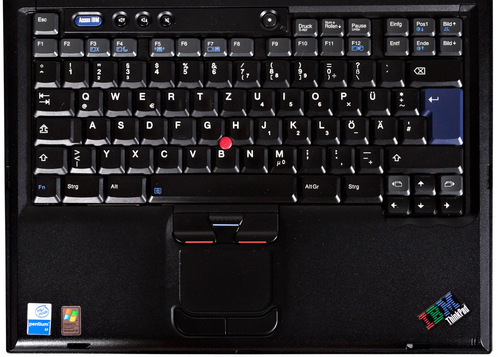

<!--

- BIOS call via Access IBM key
- Pre-boot environment with restore function
  - Requires service partition on the hard disk

-->

---

<!-- _header: 'Classic keyboard (here: T60p, 2007)' -->

- No more gray contrast as of T/R/X60
- TrackPoint buttons no longer have colors

---

<!-- _header: 'Classic keyboard (here: T410, 2010)' -->

- from the T410/X220 **illuminated** function keys, **rocker switch** for volume and **double height** of the ESC/ENTF key

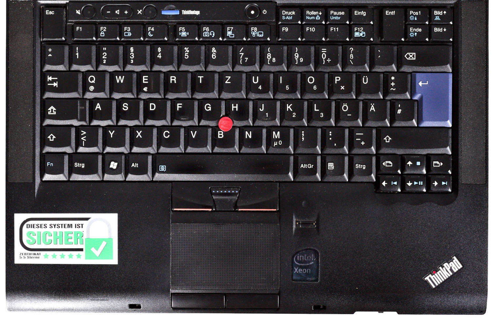

---

<!-- _header: Precision keyboard -->
<!-- footer: '[[13]](https://nuts.com/images/auto/801x534/assets/869ed4decfec61cb.jpg)' -->

- **2012** introduced in **T**, **W**, **X** and **L** series
  - installed in the **X1** for the first time
  - further tests in the Edge and X1xxe series
- **Chiclet** or Island Style keyboard
  - flat square keys with rounded corners
  - remembers of american chiclet **chewing gum**
- **6** instead of 7 rows, even on large devices
  - more **space** between the keys
  - **larger** keys, to prevent typing errors
  - no more separate function keys

---

<!-- _header: Precision keyboard (X230, 2012) -->
<!-- footer: '' -->

---

<!-- _header: Precision keyboard -->

- Page forward/next moves image down/up
- no more Num and context menu buttons
- no more blue color elements
- Buttons now only **2mm** instead of 2.5mm **high**
- **mechanism** unchanged
- **Backlight**, thus elimination of the **ThinkLight**
- Keyboard coating varies depending on the variant
  - without backlight: matt, non-slip, opaque
  - with backlight: smooth, slightly slippery finish

---

<!-- _header: Classic keyboard revival (T25, 2017) -->

---

<!-- _header: IBM Palm Top PC110 (1995) -->
<!-- footer: '[[14]](https://en.wikipedia.org/wiki/IBM_Palm_Top_PC_110), Intel 80486 @ 33 MHz, 4 to 20 MB RAM' -->

- Palmtop with **4.7" DSTN** display
  - 640x480 and 256 colors
- 4 MB Flash + PCMCIA/CF
- narrower but thicker than a VHS cassette, **630g** weight
- Mini keyboard and touchpad
  - **TrackPoint** in top left
- Microphone and loudspeaker
  - Can also be used as a **telephone** via modem

---

<!-- _header: IBM Palm Top PC110 (1995) -->
<!-- footer: '[[14]](https://en.wikipedia.org/wiki/IBM_Palm_Top_PC_110), [[15]](https://www.youtube.com/watch?v=D-v6kyEDCNo)' -->

Docking station

PC110 as phone

<!-- 

- Nokia has clearly copied IBM with the N-Gage...

-->

---

<!-- _header: ThinkPad TV tuner (1994/1995)  -->
<!-- footer: '[[16]](https://forum.thinkpads.com/viewtopic.php?t=134090), Transmitter/input selection, configuration, on/off' -->

- for **355**, **360**, **370** and **750**
- replaces the floppy
- external antenna and additional **composite port**
- Buttons for control*
- module was switched on after the notebook, took over **TFT** control
  - Operating system continued to run in the background

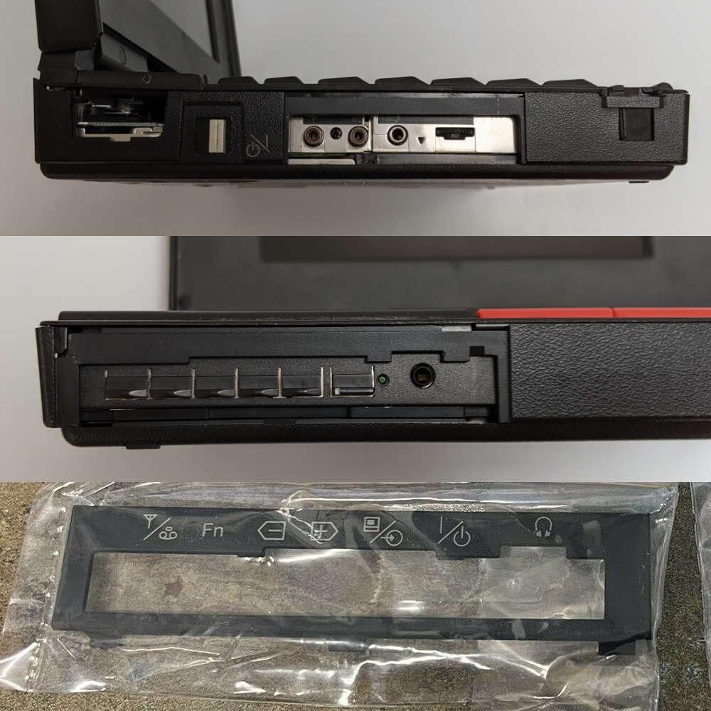

<!--

- incompatible with STN screens

-->

---

<!-- _header: ThinkPad TV tuner (1994/1995)  -->
<!-- footer: '[[16]](https://forum.thinkpads.com/viewtopic.php?t=134090), [[17]](https://www.youtube.com/watch?v=Kp2RMttq7l0)' -->

External antenna

TV picture with integrated channel display

---

<!-- _header: ThinkPad 360P/PE Tablet (1994 - 1996)  -->
<!-- footer: '[[18]](https://commons.wikimedia.org/wiki/Category:ThinkPad_360PE)' -->

- 9.5" **Convertible Tablet**
  - Screen rotatable **in the frame**
- Intel 80486 with 33 or 50 MHz
- 4 to 20 MB RAM
- 170 to 540 MB HDD
- **DIN A4** format, **~3.1kg** weight
- came with Windows 3.1 or 95
  - 3.1 already had optional pen support (**Windows for Pencomputer 1.0**)

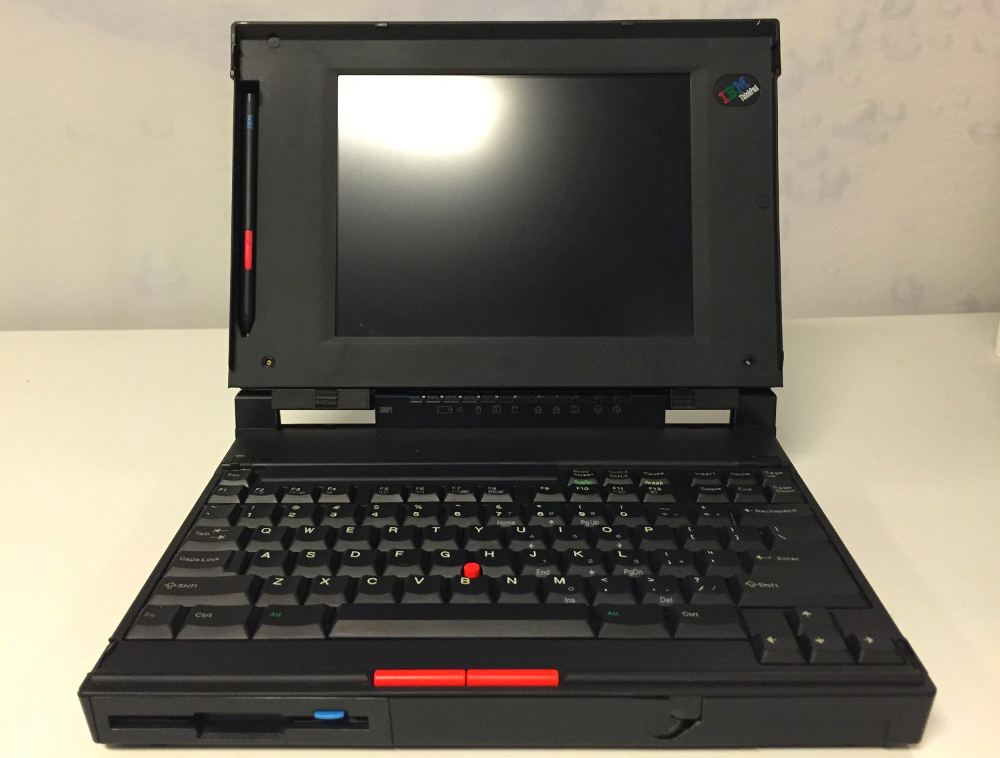

---

<!-- _header: ThinkPad 360P/PE Tablet (1994 - 1996)  -->

In frame rotation

Tablet mode

---

<!-- _header: Excursus: Windows for Pencomputer 1.0 (1992) -->
<!-- footer: '[[19]](https://winhistory.de/more/win31.htm#pen)' -->

On-Screen keyboard

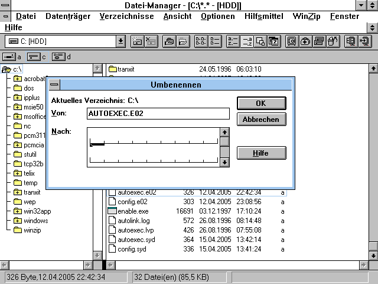

System dialog input field

---

<!-- _header: IBM TransNote (2001 - 2003)  -->
<!--
footer: '[[20]](https://thinkwiki.de/Transnote), Intel Pentium 3 Mobile, 600 MHz, 64-320 MB SDRAM, 10.4" touch screen, 10-20 GB HDD'
-->

- ThinkPad with digital writing pad (**ThinkScribe**)
- transfers handwriting and drawings as **bitmap**
- Can also be used when the notebook is switched off
- requires special **pen**
  - transfers position via **radio**
  - also writes with ink
- partly based on the **X21***

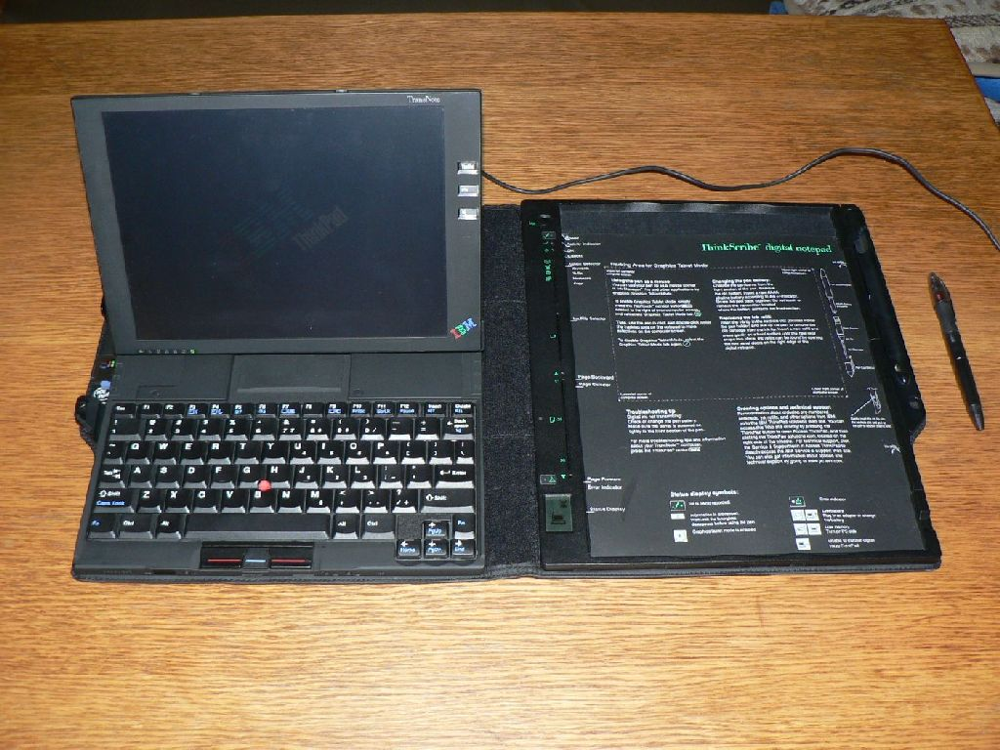

---

<!-- _header: IBM TransNote (2001 - 2003)  -->
<!--
footer: '[[21]](https://pc.watch.impress.co.jp/docs/article/990204/crosspad.htm)
, produced between 1998 and 2001'
-->

- there was even a **left-handed** conversion kit
- based on the **CrossPad***
  - Collaboration between IBM and **A.T. Cross**
  - external writing pad
- very complex design
  - especially the pen required a lot of housing adjustments
- Price: ~3,000 USD (**4,780 EUR**)

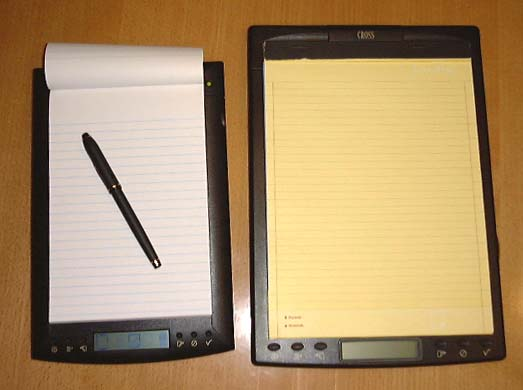

CrossPad XP and CrossPad

<!--

- A.T. Cross is a US manufacturer of writing instruments and watches
  - have been producing the pens of US presidents since the 1970s
- CrossPad cost 399 USD in 1998
  - converted + adjusted for inflation 690 EUR
  - later sold for 99 USD
- Device was ahead of its time and therefore flopped
- One criticism was that it was too big
  - IBM bought rows of airplane seats and proved how comfortable it was to use
- became cheaper and cheaper over time and was eventually sold for **749 USD**

-->

---

<!-- _header: IBM TransNote (2001 - 2003)  -->
<!--
footer: '[[22]](https://www.reddit.com/r/thinkpad/comments/1q0g9z/any_love_for_a_factory_lefthanded_thinkpad/), [[23]](http://www.ibmfiles.com/pages/transnote.htm)'
-->

Left-handed version

Different display positions

---

<!-- _header: ThinkPad Tablet (2011 - 2012)  -->
<!--
footer: '[[24]](https://thinkwiki.de/ThinkPad_Tablet), NVIDIA Tegra 2, 1 GB RAM, 10.1"-TFT (1280x800)'
-->

- only **Android** tablet*
- Android 3.1 and 4.0.3
  - hardly any alternative ROMs
- Headphones and **input pen**
- optional docking and case with built-in keyboard
- Pre-installed business applications
- heavy (753g) and expensive (~899 EUR)

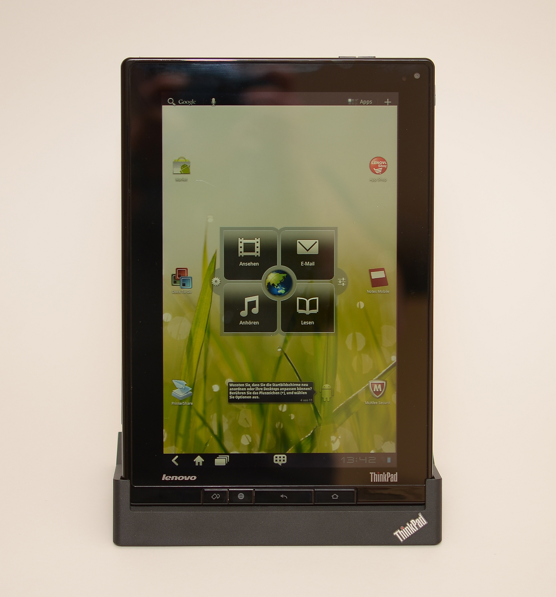

---

<!-- _header: Japenese exclusives -->
<!--
footer: '[[25]](https://thinkwiki.de/550)'
-->

- there were special models for the Asian region early on
- small devices and **collaborations**
  - Canon (**550BJ, 555BJ**)
  - Ricoh (**235**)
- still exist today
  - e.g. keyboard with more keys
  - T14p, R14, S2, ThinkPad neo

550BJ with integrated printer

---

<!-- _header: ThinkPad 220 (1993) -->
<!-- footer: '[[26]](https://commons.wikimedia.org/wiki/Category:ThinkPad_220), 226x166x32mm with 1 kg weight' -->

- early Ultra Portable*
- Intel 386SL with 16 MHz
- 2 to 10 MB RAM
- 7.7" STN grayscale display
  - 640x480, color via VGA
  - **without backlight**
- 80 MB HDD
- could also be operated with 6x AA batteries

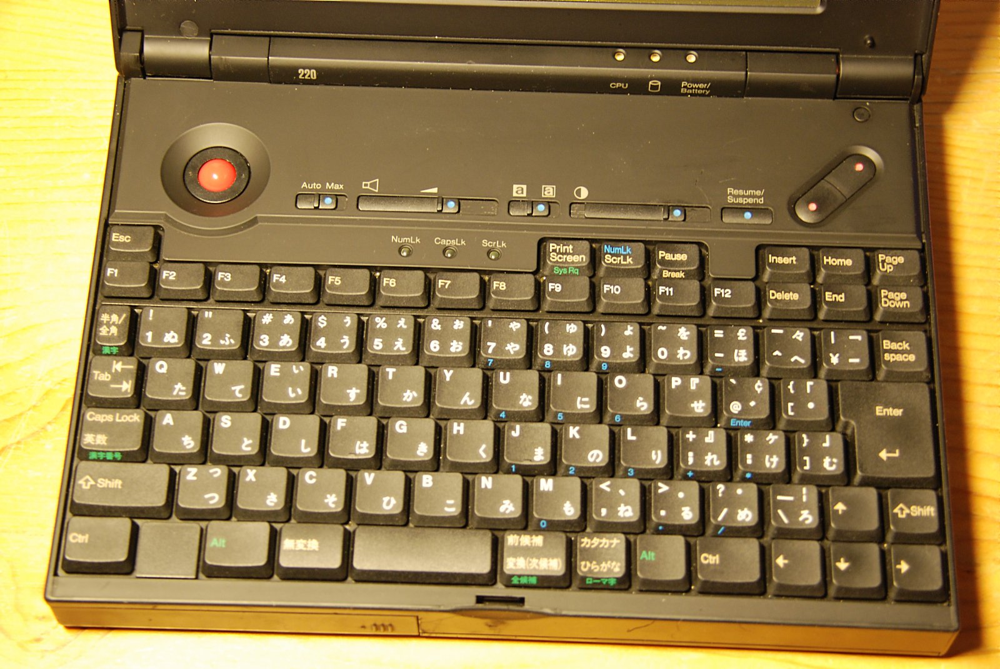

---

<!-- _header: ThinkPad 220 (1993) -->
<!-- footer: '[[26]](https://commons.wikimedia.org/wiki/Category:ThinkPad_220)' -->

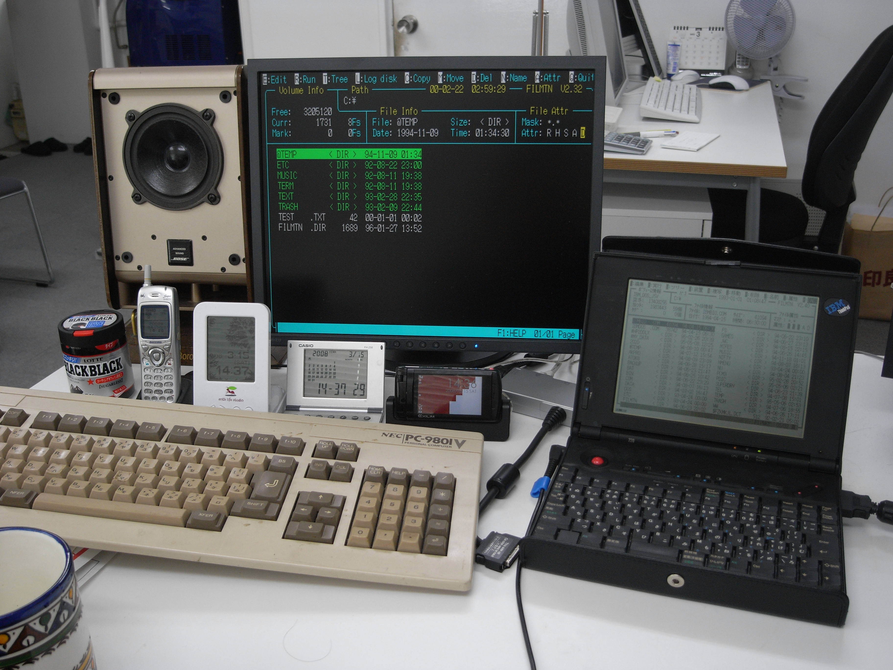

---

<!-- _header: ThinkPad 235 / Ricoh Magio* (1998)  -->
<!--
footer: '[[27]](https://www.youtube.com/watch?v=RDyMw7t9bdw), aka: Hitachi VisionBook Traveler, Epson Endeavor TK-300/400, Hitachi Flora Prius Note 210'
-->

---

<!-- _header: ThinkPad 235 / Ricoh Magio* (1998) -->
<!--
footer: '[[28]](https://thinkwiki.de/235), aka: Hitachi VisionBook Traveler, Epson Endeavor TK-300/400, Hitachi Flora Prius Note 210'
-->

- **9.2" subnotebook** (800x600)
  - Intel Pentium 166 to 266 MHz
  - 32 to 96 MB RAM
  - **3x** PCMCIA/CardBus
  - 2x standard **Camcorder batteries**
- only available as a third-party brand outside Japan
- manufactured by **RIOS**
  - Joint venture between Ricoh and IBM Japan

Keyboard of the 350

<!--

- quite expensive at USD 2,399 (EUR 4,150)
  - dropped quite quickly to 1,800 USD

-->

---

<!-- _header: ThinkPad 235 / Ricoh Magio* (1998) -->
<!--
footer: '[[27]](https://www.youtube.com/watch?v=RDyMw7t9bdw), aka: Hitachi VisionBook Traveler, Epson Endeavor TK-300/400, Hitachi Flora Prius Note 210'
-->

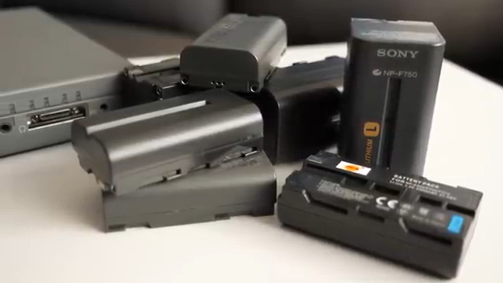

Standard Li-Ion batteries

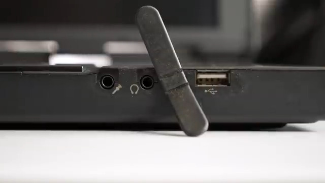

The 235 even has USB 1.1, other brands do not

<!--

- BIOS can be called up at any time via key combination 
- The TP235 has the larger and better display
  - and even USB 1.1

-->

---

<!-- _header: ThinkPad S30 / S31 (2001) -->
<!-- footer: '[[28]](https://thinkwiki.de/S30_/_S31), Intel Pentium 3 @ 600 MHz, 128-256 MB RAM, 20 GB HDD' -->

- only models in the S series
- **last** 10.4" subnotebooks
  - X-series became more compact
  - closely related to the **X20**
- S30 for Japan, S31 for the rest of Asia
- S31 is also the special model for the 10th **anniversary**
- usually shiny cover
  - later taken up in **SL** series

<!--

- S30 and X60s are almost the same size

-->

---

<!-- _header: ThinkPad S30 / S31 (2001) -->
<!-- footer: '[[28]](https://thinkwiki.de/S30_/_S31)' -->

Bellied housing adapts to the keyboard

Matt display cover, but the base in the battery is always shiny

---

<!-- footer: [[29]](https://www.thinkpad.com/device/ThinkPad-T14p-2023) -->

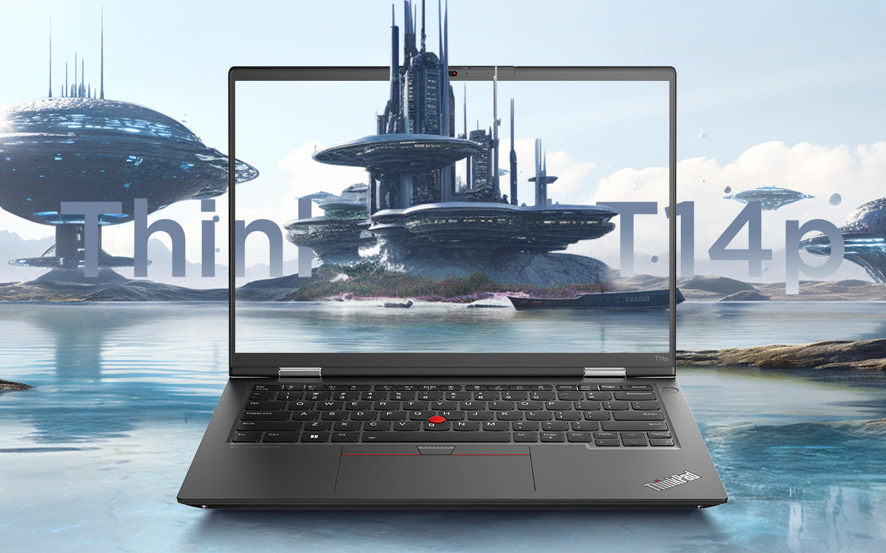

<!--

- 14" device with Intel Core i9 and NVIDIA GTX GPU
  - Strong configuration unusual, usually reserved for the P-series
- Performance variants were not available from the T470p (2017) to the T15p (2021)
  - currently only the T15p is available, no other variants
- silver display hinges are a relic of earlier devices
  - no longer available outside Asia since the T430 (2014)
  - only the P16 still has it

-->

---

<!-- _header: Links -->
<!-- footer: '' -->

- [FrOSCon 2024: ThinkPads - Geschichte und Nerdkultur](https://media.ccc.de/v/froscon2024-3141-thinkpads) 🎥🇩🇪
- [ThinkPad-Forum](https://thinkpad-forum.de) 🇩🇪
- [ThinkPad-Wiki](https://thinkwiki.de) 🇩🇪
- [International ThinkWiki](https://thinkwiki.org)
- [Notebookcheck posts about ThinkPads](https://www.notebookcheck.com/News.37.0.html?ns_layout=3&hide_youtube=1&ns_show_num_normal=50&hide_external_reviews=1&tagArray%5B%5D=153&typeArray%5B%5D=4&typeArray%5B%5D=6&id=37) 🇩🇪
- [Laptop Retrospective](https://laptopretrospective.com) 🎥📖
- [HK003 - ThinkPads](https://hacker-kultur.de/episodes/003.html) 🎙️🇩🇪
- [BW099 - Ein denkwürdiges Notebook](https://besserwissen.podigee.io/99-thinkpad) 🎙️🇩🇪
- [ThinkPad museum](https://thinkpad-museum.com)
- [ThinkPad museum database](https://db.thinkpad-museum.com)

---

<!-- _header: Books -->

There are suitable **books** on these topics:

- How the ThinkPad Changed the World - and Is Shaping the Future
  - Arimasa Naitoh, William J. Holstein
- The Race for Perfect
  - Steve Hamm, Story über das X300
- ThinkPad: A Different Shade of Blue
  - Deborah A. Dell, J. Gerry Purdy
- **Richard Sapper, Edited by Jonathan Olivares**
  - Hardcover book with a lot of photos

---

<!-- _header: ThinkPad museum podcast (🇩🇪) -->

- published every **~4 weeks**
- deals with the past and present
- News, models, techniques and personalities
- **interactive** format, guests welcome!
- available wherever you get your podcasts™
  - [Feed](https://podcasts.darmstadt.social/@thinkpadmuseum/feed.xml), [fyyd](https://fyyd.de/podcast/thinkpad-museum-podcast), [Apple Podcasts](https://podcasts.apple.com/us/podcast/thinkpad-museum-podcast/id1722845536), [Spotify](https://open.spotify.com/show/1Tyf65RpY3bKZr0xYVFhjc)

---

<!-- _header: Image sources -->

- [Richard Sapper](https://en.wikipedia.org/wiki/Richard_Sapper)
- [Artemide Tizio](https://commons.wikimedia.org/wiki/File:Lampe_Tizio_von_Richard_Sapper.jpg)
- [IBM Model 5140](https://richardsapperdesign.com/products/mod-5140/)
- [Tizio und T430](https://www.reddit.com/r/thinkpad/comments/h16v1f/tizio_and_thinkpad_the_perfect_classical)
- [Lenowo BIOS logo](https://www.reddit.com/r/thinkpad/comments/112wxih/custom_boot_screen_on_my_p1_gen4/)
- [Knives Out](https://productplacementblog.com/movies/lenovo-thinkpad-t61-laptop-used-by-christopher-plummer-as-harlan-thrombey-in-knives-out-2019/)
- [Ted Selker](https://youtu.be/Wpw7Bml_XvI)
- [TrackPoint PCB](https://de.wikipedia.org/wiki/Datei:Pointing_stick_of_a_Lenovo_ThinkPad_keyboard-4488.jpg)
- [TrackPoint types](https://www.reddit.com/r/thinkpad/comments/h16v1f/tizio_and_thinkpad_the_perfect_classical)
- [Scissor switch](https://deskthority.net/wiki/Scissor_switch)
- [TrackWrite keyboard](https://en.wikipedia.org/wiki/File:IBM_ThinkPad_701C_keyboard.jpg)
- [George Karidis](https://youtu.be/rDjg4dKWQ2Y)
- [Chiclet gum](https://nuts.com/images/auto/801x534/assets/869ed4decfec61cb.jpg)
- [IBM PC110](https://en.wikipedia.org/wiki/IBM_Palm_Top_PC_110)
- [IBM PC110 phone](https://www.youtube.com/watch?v=D-v6kyEDCNo)
- [ThinkPad 750 TV tuner pack](https://forum.thinkpads.com/viewtopic.php?t=134090)

- [ThinkPad 750 TV tuner demo](https://www.youtube.com/watch?v=Kp2RMttq7l0)
- [360PE](https://commons.wikimedia.org/wiki/Category:ThinkPad_360PE)
- [Windows for Pencomputer 1.0](https://winhistory.de/more/win31.htm#pen)
- [IBM TransNote](https://thinkwiki.de/Transnote)
- [CrossPad XP](https://pc.watch.impress.co.jp/docs/article/990204/crosspad.htm)
- [TransNote Left-handed](https://www.reddit.com/r/thinkpad/comments/1q0g9z/any_love_for_a_factory_lefthanded_thinkpad/)
- [TransNote stages](http://www.ibmfiles.com/pages/transnote.htm)
- [ThinkPad Tablet](https://thinkwiki.de/ThinkPad_Tablet)
- [550BJ](https://thinkwiki.de/550)
- [220](https://commons.wikimedia.org/wiki/Category:ThinkPad_220)
- [235 vs. Ricoh Magio](https://www.youtube.com/watch?v=RDyMw7t9bdw)
- [235](https://thinkwiki.de/235)
- [S30 / S31](https://thinkwiki.de/S30_/_S31)
- [T14p](https://www.thinkpad.com/device/ThinkPad-T14p-2023)

---

<!-- _class: lead -->

# 🔴 Thank you for your attention
